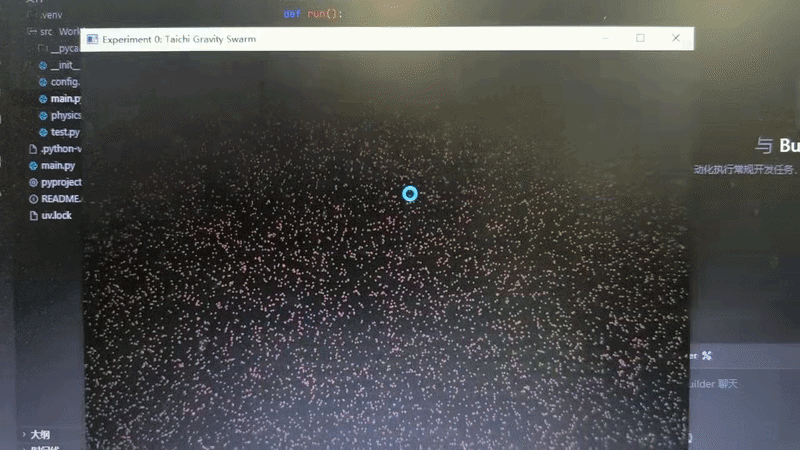

<div align="center">
  <h2><i>CG_work0:万有引力</i></h2> 
</div>

<div align="center">
  
>第一次计算机图形学作业:
>项目架构、代码逻辑及效果展示
</div>

**一、项目架构**

本次实验项目名称为Work0，严格按照src布局规范整理目录，实现代码分层解耦，具体目录结构如下：
```bash
CG-Lab/
├── .gitignore
├── README.md
├── src/
│   └── Work0/
│       ├── __init__.py
│       ├── config.py
│       ├── physics.py
│       └── main.py
└── .venv/
```

项目分为三层，分别是参数配置层（config.py）、底层计算层（physics.py）、前端视图层（main.py），各层功能独立，方便修改和维护。

**二、代码逻辑**

1.  config.py：作为参数配置层，集中定义整个项目的所有可配置信息，避免代码硬编码，方便后续修改调试。具体包括窗口配置（宽度、高度、标题）、粒子配置（数量、半径、质量）、物理参数（万有引力常数、时间步长、阻尼系数）、硬件配置（GPU后端、设备编号）以及渲染配置（背景色、粒子颜色），所有参数统一管理，其他文件直接导入使用。
   
2.  physics.py：作为底层计算层，基于Taichi框架实现GPU并行计算逻辑。首先初始化Taichi并绑定GPU后端，将粒子的位置、速度、加速度定义为GPU显存中的向量场，实现大规模数据的并行访问。然后通过@ti.kernel装饰器编写三个核心并行函数：一是粒子初始化函数，随机分配粒子在窗口内的初始位置，设置初始速度为0；二是万有引力计算函数，遍历所有粒子，两两计算相互间的引力，根据万有引力定律计算加速度并累加；三是粒子状态更新函数，根据加速度更新粒子速度，加入阻尼系数防止速度过大，再根据速度更新粒子位置，同时判断粒子是否触碰窗口边界，实现边界反弹逻辑。

3.  main.py：作为前端视图层，负责连接计算层与用户交互。首先导入config.py的参数和physics.py的核心计算函数，然后创建可视化窗口和画布，初始化粒子状态。进入主循环后，依次调用physics.py中的万有引力计算函数和粒子状态更新函数，完成粒子物理状态的并行更新；再通过画布渲染粒子，设置背景色和粒子颜色，将粒子的实时位置渲染到窗口中；同时创建GUI参数调节面板，支持运行时调节引力常数，动态改变粒子间的吸引力大小，最后更新窗口显示，循环执行以上流程，实现实时仿真。

**三、效果展示**


