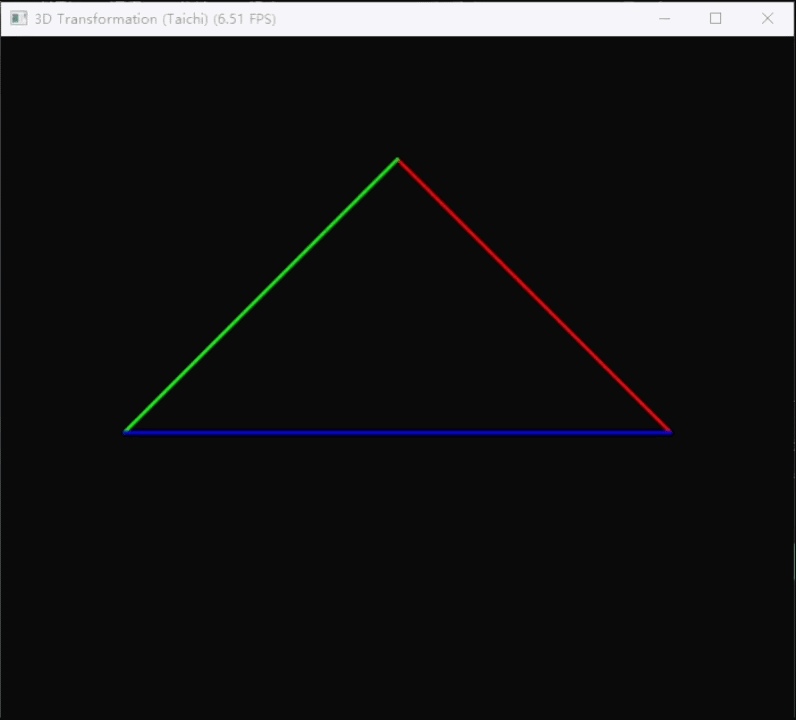

<div align="center">
  <h2><i>CG_work1:旋转与变换</i></h2> 
</div>

<div align="center">
  
>第二次计算机图形学作业:
>项目架构、代码逻辑及效果展示
</div>

**一、项目架构**

本次实验项目名称为Work1，严格按照src布局规范整理目录，具体目录结构如下：
```bash
CG-Lab/
├── .gitignore
├── src/
│   └── Work1/
│       ├── README.md
│       ├── __init__.py
│       └── tri.py
└── .venv/
```


**二、代码逻辑**

  该代码依托 Taichi 框架完成三维三角形的模型、视图、投影变换及二维屏幕绘制，整体流程为初始化三维顶点数据，生成模型、视图、投影三类变换矩阵，并行执行模型、视图、投影坐标变换，该过程包含透视除法与视口映射环节，随后监听键盘交互更新旋转角度，最终实时绘制三角形线框，完整复现三维空间到二维屏幕的投影过程。
  
  基础初始化环节需先完成 Taichi 框架的初始化，定义显存级数组，其中 vertices 数组存储三维顶点，screen_coords 数组存储二维屏幕坐标，同时设置三角形初始顶点参数，创建分辨率为 700x700 的 GUI 窗口，为后续计算与绘制工作奠定基础。变换矩阵生成环节中，所有矩阵均为 4x4 齐次矩阵，适配三维齐次坐标计算；模型矩阵将输入的角度制旋转角转换为弧度，构建绕 Z 轴旋转的矩阵，实现三角形的旋转效果；视图矩阵依据相机位置构建平移矩阵，将相机平移至世界坐标系原点，该过程等价于将场景向相机反方向平移；投影矩阵先将透视平截头体挤压为正交长方体，再通过缩放与平移操作将长方体归一化到标准设备坐标系，该坐标系取值范围为 [-1,1]，完成从透视投影到正交投影的转换。并行坐标变换环节借助 @ti.kernel 装饰器并行处理每个顶点，先补全三维顶点的齐次坐标，将 w 值设为 1，再利用组合后的模型、视图、投影矩阵完成坐标变换，矩阵组合顺序为投影矩阵在前，视图矩阵居中，模型矩阵在后，执行透视除法将坐标归一化到标准设备坐标系，最后将标准设备坐标系下的坐标映射到取值范围为 [0,1] 的屏幕坐标，并存储至 screen_coords 数组。交互与渲染环节在循环中监听键盘事件，按下 A 键或 D 键可修改旋转角度，按下 Esc 键则退出程序，每次循环调用变换函数更新屏幕坐标，通过 gui.line 接口绘制三角形的三条彩色线框，刷新窗口以实现旋转动画效果。

**三、效果展示**


