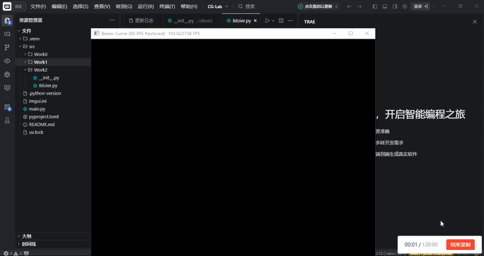

<div align="center">
  <h2><i>CG_work2:Bézier曲线/B样条曲线</i></h2> 
</div>

<div align="center">
  
>第三次计算机图形学作业:
>项目架构、代码逻辑及效果展示
</div>

**一、项目架构**

本次实验项目名称为Work2，严格按照src布局规范整理目录，具体目录结构如下：
```bash
CG-Lab/
├── .gitignore
├── src/
│   └── Work2/
│       ├── README.md
│       ├── __init__.py
│       └── Bézier.py
└── .venv/
```


**二、代码逻辑**

程序基于Taichi框架实现GPU加速的交互式贝塞尔曲线绘制，整体流程分为环境初始化、数据定义、曲线计算、并行渲染与交互控制五个部分。程序导入Taichi与NumPy库后，初始化GPU计算后端，设定窗口尺寸、最大控制点数量与曲线采样段数，在显存中预定义像素场、控制点场、索引场与曲线点场，分别用于存储画面像素、交互控制点、连线索引与贝塞尔曲线采样点数据。

De Casteljau算法以递归方式在CPU端执行，接收控制点列表与插值参数t，通过逐次对相邻控制点线性插值，最终返回参数t对应的曲线上点坐标，完成单一点位的贝塞尔曲线计算。清空像素核函数在GPU端并行遍历所有像素，将像素值重置为黑色，实现画布清空操作。绘制曲线核函数同样在GPU端并行执行，遍历预存的曲线点数据，将归一化坐标转换为像素坐标，在坐标合法范围内将对应像素设为绿色，完成曲线渲染。

主函数创建渲染窗口与画布对象，维护控制点列表，在窗口运行循环中持续处理交互事件。鼠标左键点击可添加控制点，按下C键清空所有控制点与画布内容。每一帧先执行画布清空操作，当控制点数量不少于两个时，在CPU端遍历采样参数，通过De Casteljau算法计算全部曲线点并存储至NumPy数组，再将数组数据一次性传输至GPU显存，随后调用绘制核函数完成曲线渲染。程序将控制点数据传入画布绘制红色圆点，构建控制点连线索引并绘制灰色辅助线，最后刷新窗口完成画面显示。


**三、效果展示**


