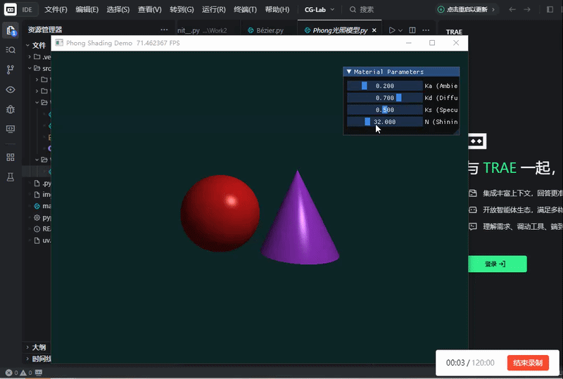

<div align="center">
  <h2><i>CG_work3:Phong光照模型线</i></h2> 
</div>

<div align="center">
  
>第四次计算机图形学作业:
>项目架构、代码逻辑及效果展示
</div>

# 一、项目架构

本次实验项目名称为Work2，严格按照src布局规范整理目录，具体目录结构如下：
```bash
CG-Lab/
├── .gitignore
├── src/
│   └── Work3/
│       ├── README.md
│       ├── __init__.py
│       └── Phong光照模型.py
└── .venv/
```


# 二、代码逻辑

代码基于Taichi框架实现GPU加速的光线追踪渲染，程序整体围绕像素级光线计算、几何体相交检测与Phong光照模型展开，最终完成实时可交互的三维物体渲染。程序初始化阶段设定渲染分辨率并创建三维向量场存储像素颜色，同时定义环境光系数、漫反射系数、高光系数与高光指数四类标量参数，用于后续光照计算。代码内置向量归一化与光线反射计算函数，为几何求交与光照运算提供基础数学支持。

光线与球体相交计算通过构建光线方程与球面方程，求解二次方程判别式判断交点存在性，获取有效交点后计算对应法向量。光线与圆锥相交采用局部坐标转换方式，建立圆锥曲面方程并求解二次方程，筛选符合高度范围的有效交点，同步得出圆锥表面法向量。

渲染内核以并行方式遍历所有像素，将像素坐标映射至相机空间，生成从相机出发的观测光线。程序依次检测光线与球体、圆锥的相交状态，记录距离最近的有效交点、对应法向量与物体颜色。未检测到相交时像素使用预设背景色，检测到有效相交则基于交点位置执行Phong光照计算。

光照计算分为环境光、漫反射与高光三个部分，环境光提供基础亮度保证物体不出现完全暗部，漫反射依据光线与法向量夹角决定明暗层次，高光通过反射方向与视线方向的夹角计算，高光指数控制高光区域的收敛程度。最终将三类光照分量叠加并限制数值范围，得到对应像素的渲染颜色。

主程序创建渲染窗口与交互界面，初始化光照参数并进入循环渲染流程。窗口侧边提供参数调节面板，可通过滑块实时修改光照相关系数，参数变化直接作用于下一帧渲染结果，实现光照效果的动态调整与实时显示。


# 三、效果展示



