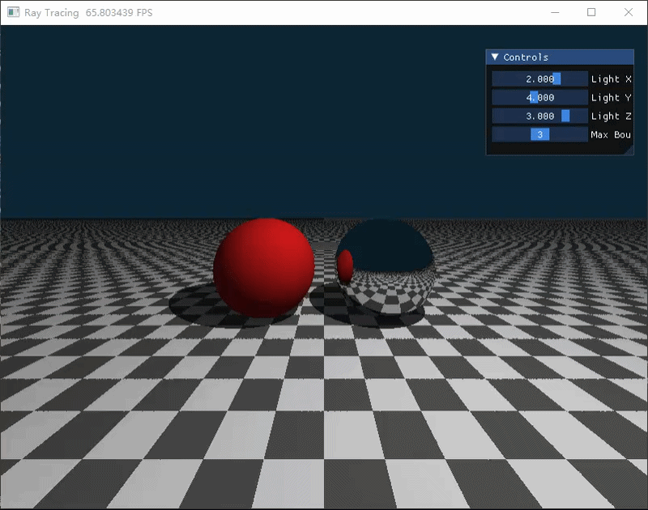

<div align="center">
  <h2><i>CG_work4:光线追踪</i></h2> 
</div>

<div align="center">
  
>第五次计算机图形学作业:
>项目架构、代码逻辑及效果展示
</div>

# 一、项目架构

本次实验项目名称为Work4，严格按照src布局规范整理目录，具体目录结构如下：
```bash
CG-Lab/
├── .gitignore
├── src/
│   └── Work4/
│       ├── README.md
│       ├── __init__.py
│       └── 光线追踪.py
└── .venv/
```


# 二、代码逻辑

程序预设固定渲染窗口分辨率，创建像素颜色存储字段，用于承载每一帧渲染完成后的画面色彩数据，同时配置光源三维坐标、光线最大弹射次数两类可调参数字段，搭配漫反射、镜面反射两类基础材质标识，为后续光线交互计算与场景渲染提供基础数据支撑。

内置多项基础数学运算与几何求交核心计算函数，向量归一化函数统一所有运算向量的长度标准，仅保留方向属性，保障光线计算精度。光线反射函数依据入射光线与物体表面法线，精准计算光线触碰物体后的反射行进方向。球体几何求交函数以光线起点、光线行进方向、球体中心坐标、球体半径为基础参数，通过一元二次方程求解运算，判断光线与球体是否产生交汇，输出光线碰撞球体的行进距离与球体碰撞点位表面法线数据。平面几何求交函数专门适配水平无限大地板结构，测算光线与地板平面的交汇位置，固定地板平面法线朝向，贴合三维场景空间布局规则。

场景整体求交计算模块统筹检测光线与整个场景所有物体的碰撞情况，依次判定光线与左侧红色漫反射球体、右侧银色镜面反射球体、底部棋盘格地板的交汇状态，筛选出光线行进路径中距离最近的碰撞目标。模块同步记录最近碰撞点位的法线数据、物体基础着色数值、物体对应材质类型，地板区域通过平面坐标网格缩放与坐标奇偶判定，生成交替深浅变化的棋盘格纹理效果，丰富场景基础视觉表现。

渲染核心内核为程序画面生成核心模块，读取实时调控的光源空间坐标与光线最大弹射数值，设定固定天空背景基础颜色。程序对渲染窗口每一个像素点位进行并行遍历，将像素二维坐标转换为三维空间视角对应参数，确定虚拟摄像机固定摆放位置与初始光线发射行进方向。每个像素对应发射一条初始追踪光线，设置光线能量吞吐量参数，用于记录光线多次弹射过程中的能量衰减情况。光线按照预设最大弹射次数循环行进，每一次行进均执行场景物体求交检测，未碰撞任何物体时，叠加背景颜色数据并终止当前像素光线追踪流程，碰撞物体则定位具体碰撞空间点位。

程序按照物体材质类型执行差异化光线计算逻辑，镜面反射材质物体接收光线后，测算光线标准反射方向，微调光线发射起点位置避免光线自相交计算错误，按照固定反射衰减系数降低光线能量数值，延续光线弹射循环，完成多次镜面反射追踪计算。漫反射材质物体接收光线后，测算碰撞点位指向光源的空间方向，同步开启硬阴影检测，从碰撞点位向光源方向发射阴影检测光线，判断光线行进路径是否被场景物体遮挡，结合检测结果区分阴影区域与受光区域。依托基础冯氏光照模型，叠加环境基础光照与漫反射直接光照，累计光线吞吐量对应的画面颜色数值，漫反射表面终止光线后续弹射流程，完成当前像素最终色彩计算。所有像素色彩计算完成后，统一做数值范围限制处理，将合规色彩数据写入像素存储字段，生成完整渲染画面。

主运行模块创建可视化渲染窗口与交互控制面板，初始化光源初始空间坐标与光线最大弹射基础数值，持续循环执行渲染内核计算指令，实时刷新渲染窗口画面内容。交互控制面板设置滑动调控组件，支持动态调整光源三维坐标参数与光线最大弹射次数，参数修改后即时生效并同步更新渲染画面效果，窗口持续保持运行状态，实现光线追踪场景实时渲染与动态参数调节功能。


# 三、效果展示




