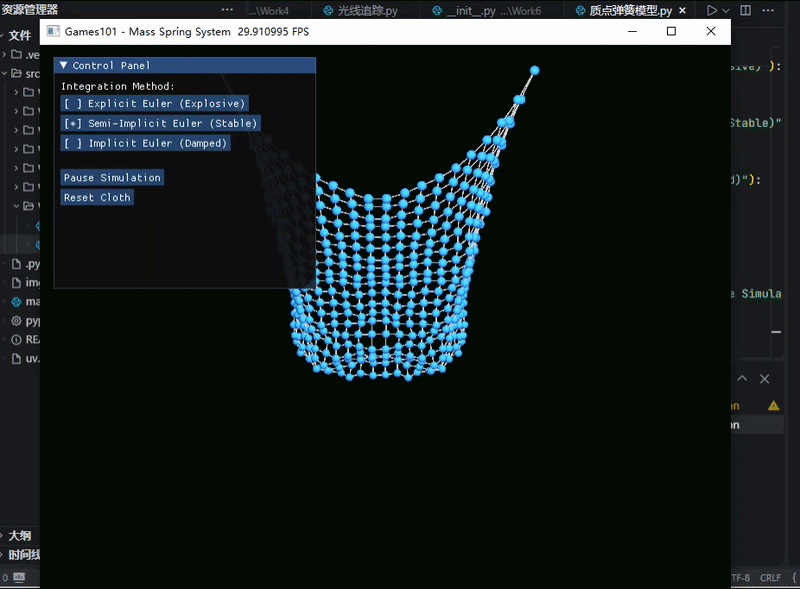

<div align="center">
  <h2><i>CG_work6:质点弹簧模型</i></h2> 
</div>

<div align="center">
  
>第七次计算机图形学作业:
>项目架构、代码逻辑及效果展示
</div>

# 一、项目架构

本次实验项目名称为Work6，严格按照src布局规范整理目录，具体目录结构如下：
```bash
CG-Lab/
├── .gitignore
├── src/
│   └── Work6/
│       ├── README.md
│       ├── __init__.py
│       └── 质点弹簧模型.py
└── .venv/
```


# 二、代码逻辑

程序基于Taichi GPU加速框架开发，核心实现二维网格布料的物理模拟，依托质点弹簧系统完成布料形变与运动计算。程序初始化GPU运算架构，定义模拟所需基础物理参数与网格参数。20、20规格的质点网格构成布料主体结构，所有质点统一设置固定质量。模拟时间步长、弹簧刚度系数、运动阻尼系数、重力加速度、质点最大运动速度为核心调控参数，用于约束整体模拟效果与运动稳定性。
程序定义多组三维矢量存储字段与状态标记字段，用于记录布料所有质点的位置、速度、受力数据，同时标记质点固定状态。额外创建三组临时状态字段，存储隐式积分运算过程中的迭代数据。程序预设弹簧最大数量，配置对应字段记录弹簧连接质点对、弹簧原始长度与弹簧总数量，配套设置渲染索引字段，满足后续布料线条渲染需求。

质点位置初始化模块会遍历完整网格结构，将二维网格坐标转化为一维质点索引。所有质点按照均匀间距完成空间排布，初始速度与初始受力统一归零。网格第一行两端质点设置为固定状态，其余质点保持自由运动状态，形成双侧悬挂的布料初始形态。

弹簧结构初始化模块以单个质点为基础单元，依次为质点右侧、下侧相邻质点构建连接弹簧。每生成一组弹簧结构，程序自动统计弹簧总数量，记录弹簧两端对应的质点索引，同时根据质点初始位置计算并存储弹簧静止状态下的原始长度。弹簧索引初始化模块会整合所有弹簧连接关系，转化为图形渲染可识别的索引序列，为布料网格线条绘制提供数据支撑。整体布料初始化流程依次完成质点位置赋值、弹簧结构搭建、渲染索引转换，完成模拟场景的初始构建。

物理力计算模块为模拟核心运算模块，先对所有质点统一施加重力与速度阻尼力，抵消质点多余运动动能，保证模拟稳定性。遍历所有弹簧结构，获取弹簧两端质点的实时空间位置，计算质点间距与空间方向向量。基于胡克定律计算弹簧形变产生的弹性力，根据作用力与反作用力原理，为两端质点叠加大小相等、方向相反的弹性力，完整汇总单个质点的所有受力数据。

速度约束模块实时检测质点运动速度大小，质点运动速度超出预设最大值时，程序保留质点原有运动方向，将速度数值限制在合理区间，规避超大速度导致的模拟失真与程序崩溃问题。

程序搭载三种数值积分算法，实现不同精度与稳定性的质点运动更新。显式欧拉积分先基于当前速度更新质点空间位置，再结合质点受力与质量更新运动速度，该运算方式计算简单但稳定性较差，极易出现运动发散问题。半隐式欧拉积分优先基于当前受力更新质点速度，再以更新后的速度计算质点新位置，运算稳定性显著提升，适配常规布料模拟场景。迭代隐式欧拉积分采用多轮迭代修正机制，预先缓存质点状态数据，通过多次迭代计算未来时刻的受力与运动状态，不断修正质点速度与位置数据，最终更新质点运动状态，整体模拟阻尼效果更强，运动状态最为稳定。

程序主循环集成界面渲染、参数控制、物理模拟三大核心功能。界面配置控制面板，支持切换三种积分算法、暂停恢复模拟、重置布料初始状态。模拟运行过程中，程序通过多轮小步长迭代运算细化物理更新流程，提升动画流畅度。程序开放相机视角调控功能，配置场景环境光与点光源，实时渲染质点球体与弹簧网格线条，持续刷新画面，完成动态布料模拟效果的实时展示。


# 三、效果展示




